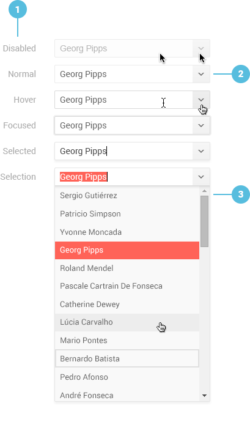

# ComboBox Overview

The Kendo UI ComboBox for React displays a list of pre-defined options. It allows the user to pick a single value from that list, or to enter a custom value through a keyboard input.

The Kendo UI ComboBox for React is part of the DropDowns `npm` package of the Kendo UI suite for React.

**Figure 1: A template of the ComboBox for React**



1. ComboBox interaction states
2. Drop-down **Expand** / **Collapse** button
3. Drop-down list

## Demos

### Default Setup

The example below demonstrates the default setup of a Kendo UI ComboBox for React.

```html-preview
    <div id="app"></div>
```
```jsx
    const data = [ "Item 1", "Item 2", "Item 3" ];

    ReactDOM.render(
		<KendoReactDropdowns.ComboBox data={data} />,
		document.getElementById('app')
    );
```

## Configuration

### Data

The ComboBox enables you to bind it to an array of both primitives and complex objects. When binding the component to an array of objects, specify the [`textField`](#textfield--string) and [`valueField`](#valuefield-string) properties.

The example below demonstrates how to bind to an array of primitive data.

```html-preview
    <div id="app"></div>
```
```jsx
    const data = [ "Item 1", "Item 2", "Item 3" ];

    ReactDOM.render(
		<KendoReactDropdowns.ComboBox data={data} />,
		document.getElementById('app')
    );
```

The example below demonstrates how to bind to an array of objects.

```html-preview
    <div id="app"></div>
```
```jsx
    const data = [
        { text: "Item 1", value: 1 },
        { text: "Item 2", value: 2 },
        { text: "Item 3", value: 3 }
    ];

    ReactDOM.render(
		<KendoReactDropdowns.ComboBox
			data={data}
			textField="text"
			valueField="value"
		/>,
		document.getElementById('app')
    );
```

### Value

To set the initial value of the ComboBox, use the [`value`](#value-numberstring) property.

```html-preview
    <div id="app"></div>
```
```jsx
    const data = [
        { text: "Item 1", value: 1 },
        { text: "Item 2", value: 2 },
        { text: "Item 3", value: 3 }
    ];

    ReactDOM.render(
		<KendoReactDropdowns.ComboBox
			data={data}
			textField="text"
			valueField="value"
			value={2}
		/>,
		document.getElementById('app')
    );
```

### Features

#### Apply Custom Item Rendering

To customize the ComboBox items, use the [`itemRenderer`](#itemrenderer-function) property.

```html-preview
    <div id="app"></div>
```
```jsx
    const data = [
        { FirstName: "John", LastName: "Doe", EmployeeID: 1 },
        { FirstName: "Jane", LastName: "Smith", EmployeeID: 2 },
        { FirstName: "Eric", LastName: "Weber", EmployeeID: 3 }
    ];

	const customRenderer = function(Employee) {
	    return (
            <span style={{ color: "#F00" }}>{Employee.FirstName}&nbsp;{Employee.LastName}</span>
        );
	};

    ReactDOM.render(
		<KendoReactDropdowns.ComboBox
			data={data}
			textField="text"
			valueField="value"
			itemRenderer={customRenderer}
		/>,
		document.getElementById('app')
    );
```

#### Disable the ComboBox

The ComboBox allows you to prevent user input through disabling the component. By default, the ComboBox is enabled and the [`disabled`](#disabled-booleandefault-false) property is set to `false`. To disable it, set `disabled` to `true`.

```html-preview
    <div id="app"></div>
```
```jsx
    const data = [ "Jack", "Jane", "John", "Jacob", "Jake" ];

    ReactDOM.render(
        <div>
            <p>Disabled ComboBox</p>
            <KendoReactDropdowns.ComboBox data={data} disabled />
        </div>,
        document.getElementById('app')
    );
```

### Events

The ComboBox enables you to subscribe to its events by passing the handlers through the properties of the component. Currently, the ComboBox supports the [`onChange`](#onchange-function) and [`onFilter`](#onfilter-function) events.

#### Change

The [`onChange`](#onchange-function) event fires when the ComboBox value changes. The new value is passed to the event handler.

```html-preview
    <div id="app"></div>
```
```jsx
    const data = [
        { FirstName: "John", LastName: "Doe", EmployeeID: 1 },
        { FirstName: "Jane", LastName: "Smith", EmployeeID: 2 },
        { FirstName: "Eric", LastName: "Weber", EmployeeID: 3 }
    ];

    const onChange = (value) => {
        console.log("change event triggered: ", value);
    };

    ReactDOM.render(
        <KendoReactDropdowns.ComboBox
            data={data}
            textField="text"
            valueField="value"
            onChange={onChange}
        />,
        document.getElementById('app')
    );
```

#### Filter

The [`onFilter`](#onfilter-function) event fires each time the filter input changes. The new value is passed to the event handler.

```html-preview
    <div id="app"></div>
```
```jsx
    const data = [
        { value: 1, text: "Foo" },
        { value: 2, text: "Bar" },
        { value: 3, text: "Baz" }
    ];

    class ComboBoxContainer extends React.Component {
        constructor(props) {
            super(props);
            this.state = {
                value: null,
                data: data
            };
        }

        onChange = (value) => {
            this.setState({
                value: value
            });
        }

        onFilter = (text) => {
            let result;

            if (text) {
                result = data.filter(function(item) {
                    return item.text.toLowerCase().startsWith(text.toLowerCase());
                });
            } else {
                result = data;
            }

            this.setState({
                data: result
            });
        }

        render() {
            const { data, value } = this.state;

            return (
                <KendoReactDropdowns.ComboBox
                    data={data}
                    value={value}
                    textField="text"
                    valueField="value"
                    onChange={this.onChange}
                    onFilter={this.onFilter}
                />,
            );
        }
    }

    ReactDOM.render(
        <ComboBoxContainer />,
        document.getElementById('app')
    );
```

For detailed information on the Kendo UI ComboBox configuration for React, refer to its [API documentation]().

## Keyboard Navigation

Below is the list of the keyboard shortcuts the ComboBox supports.

| SHORTCUT                            | DESCRIPTION         |
|:---                                 |:---                 |
| `Upper Arrow`                       | Highlight the previous item.      |
| `Down Arrow`                        | Highlight the next item.          |
| `Enter`                             | Select the highlighted list item. |

## Suggested Links

* [API Reference of the ComboBox Component]()
